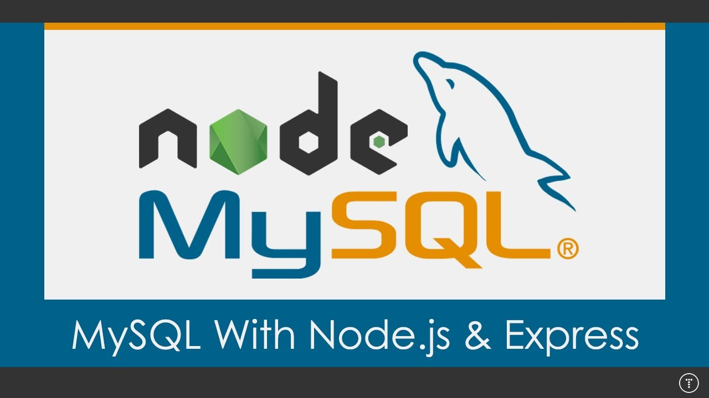

{:width="40px" height="40px"}

# NodeJs-MySQL-Tutorial


[](./LICENSE)

This repository has all the practice codes of NodeJs MySQL.

node -v
```
v10.15.2

```

Configure mysql-server and update
```
con = mysql.createConnection({
    host:`localhost`,
    user:`root`,
    password:`<your-mysql-password>`,
    database: `<name-of-the-database>`
});
```

# License

[The MIT License (MIT)](LICENSE)
